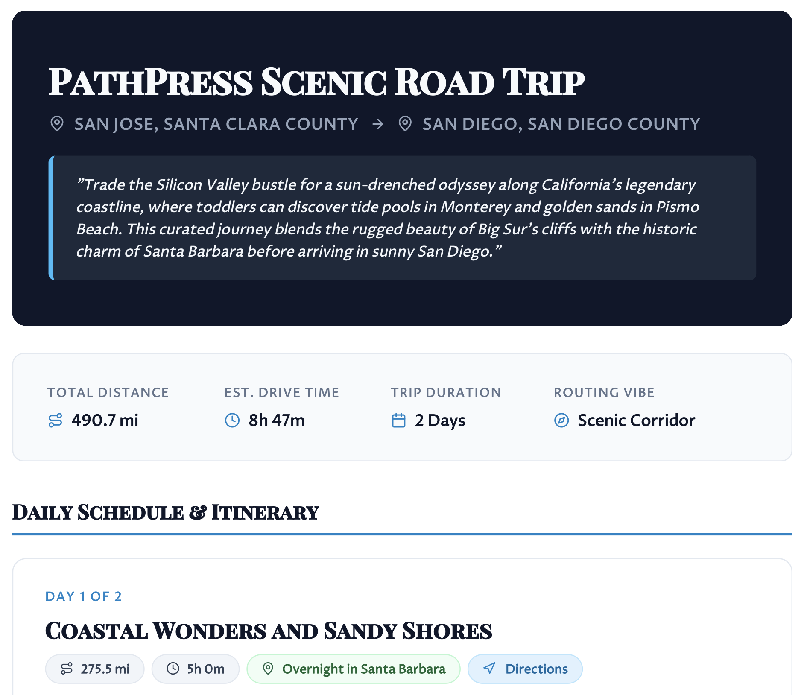

# PathPress

[](https://github.com/huangsam/pathpress/actions)
[](https://github.com/huangsam/pathpress/blob/main/LICENSE)

**PathPress** is an AI-powered road trip planner that turns trip ideas into accurate, multi-day itineraries and publication-ready PDF travel guides using real map data.



<sub>*Sample itinerary cover page presenting a trip overview before diving into day-by-day legs.*</sub>

## Motivation

Pure LLM travel planners frequently suffer from "spatial amnesia"—hallucinating routes, driving times, and non-existent locations. Conversely, standard navigation apps lack contextual storytelling and custom trip vibes.

**PathPress** bridges this gap by decoupling deterministic spatial routing from high-level AI planning - combining real-world map data with LLM storytelling to generate physically accurate, publication-ready travel guides.

## Key Features

- **Deterministic Spatial Engine**: Real map data with zero geographic hallucinations.
- **Pluggable LLM Architecture**: Supports Gemini, Claude, OpenAI, Ollama, or offline mode.
- **Publication-Ready PDF Export**: Custom-styled itineraries with turn-by-turn QR links.
- **Fuzzy Geocoding & Scenic Profiles**: Smart location resolution with scenic routing options.

## Quick Start

### 1. Build the Project
```bash
./gradlew build
```

### 2. Run PathPress Examples
```bash
# Example 1: Quick offline run (no LLM required)
java -jar build/libs/pathpress-0.5.0-standalone.jar --start "San Jose, CA" --end "Monterey, CA" --days 1 --pbf data/california-latest.osm.pbf

# Example 2: Multi-day AI trip with Ollama, custom prompt & imperial units
java -jar build/libs/pathpress-0.5.0-standalone.jar --start "San Jose, CA" --end "San Diego, CA" --days 2 --pbf data/california-latest.osm.pbf --llm-provider ollama --prompt "toddler friendly, coastal highway route, prefer scenic beach town or historic village for overnight stay" --units imperial
```

> **Tip**: Run `java -jar build/libs/pathpress-0.5.0-standalone.jar --help` to view all available CLI flags, default values, and usage options.

### 3. Downloading Map Data for Other US States
PathPress includes a helper script to fetch free OpenStreetMap data for US states:
```bash
# Download Texas map data
python3 scripts/download_pbf.py texas

# Or download all 50 US states + DC in parallel
python3 scripts/download_pbf.py --all

# Run PathPress using the downloaded Texas map data
java -jar build/libs/pathpress-0.5.0-standalone.jar --start "Austin, TX" --end "San Antonio, TX" --pbf data/texas-latest.osm.pbf
```

## Documentation

See the [**Documentation Hub**](docs/README.md) for technical guides and architecture blueprints.
