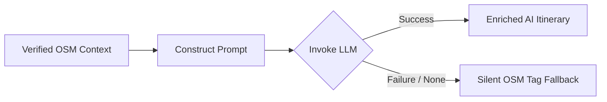

# Itinerary Planning & POI Extraction Engine

PathPress transforms raw spatial routes into multi-day road trip itineraries with balanced daily driving legs, verified overnight accommodation stops, and attractions extracted from OpenStreetMap.

---

## Multi-Day Leg Segmentation Algorithm

When planning an $N$-day trip between origin and destination, PathPress splits the continuous route polyline into discrete, achievable daily driving segments.

### Segmentation Steps
1. **Total Duration & Distance Budgeting**: The total route duration $T_{total}$ and distance $D_{total}$ from GraphHopper are divided evenly across $N$ days:
   $$\text{Target Daily Distance} = \frac{D_{total}}{N}$$
2. **Intermediate Midpoint Projection**: Coordinates along the polyline corresponding to each day's cumulative distance are identified.
3. **Overnight Settlement Snapping**: Midpoint coordinates are snapped to the nearest populated place tag in OSM (`place=city`, `place=town`, `place=village`, or `place=hamlet`).
4. **Leg Boundary Recalculation**: Sub-legs are computed between each overnight waypoint, generating daily distances, durations, and elevation profiles.

---

## Deterministic POI Extraction Engine

### The Ground-Truth Constraint
In strict accordance with `AGENTS.md` Rules 1 and 2:
- **No LLM may invent a place**: Every POI must correspond to a verified OpenStreetMap node or way.
- **Descriptions derived from OSM tags**: Descriptions are synthesized from OSM metadata (e.g., `tourism`, `historic`, `natural`, `elevation`, `opening_hours`, `wikipedia`, `wikidata`), never generated from whole cloth.

### OSM Tag Taxonomies

PathPress extracts features across five primary OSM tag domains:

| Category | High-Priority OSM Tags | Extracted Metadata |
|---|---|---|
| **Tourism** | `tourism=attraction`, `tourism=viewpoint`, `tourism=museum`, `tourism=theme_park` | Name, Viewpoint angle, Opening hours, Fee |
| **Historic** | `historic=monument`, `historic=memorial`, `historic=castle`, `historic=ruins` | Inscription, Era, Architectural style |
| **Natural** | `natural=peak`, `natural=volcano`, `natural=waterfall`, `natural=glacier`, `natural=beach` | Elevation (`ele`), Mountain range, Feature name |
| **Leisure** | `leisure=nature_reserve`, `leisure=park`, `leisure=garden` | Protection level, Park designation |
| **Culinary & Local** | `amenity=cafe`, `amenity=restaurant`, `amenity=bakery`, `amenity=brewery` | Cuisine type, Dietary offerings, Outdoor seating |

### POI Ranking & Density Filtering
To prevent visual clutter, POIs are scored and pruned:
- **Tag Richness**: Points with complete names, elevation tags, and Wikipedia links receive higher scores.
- **Corridor Proximity**: Features close to the driving route receive priority over distant detours.
- **Category Balancing**: Limits the number of identical amenities (e.g. maximum 2 bakeries per leg) in favor of varied attractions.

---

## Hybrid AI & Silent Degradation Architecture

PathPress employs a hybrid architecture where AI is strategically used to enhance itinerary overview text and highlight valid OSM waypoints, acting as an additive narrative enhancer.

### Degradation Hierarchy
1. **Tier 1 (AI Augmented)**: The LLM receives structured JSON containing verified OSM route milestones and POIs to produce concise overview text, driving tips, and historical context anchored strictly to valid waypoints.
2. **Tier 2 (Deterministic Tag Fallback)**: If the LLM call fails or `--llm-provider none` is set, PathPress automatically synthesizes narratives using raw OSM tag values (`name`, `historic:civilization`, `natural=peak + ele=...`, etc.).
3. **Tier 3 (Minimal Structural Fallback)**: If metadata is sparse, cleanly formatted route bullet points and waypoint tables are rendered.

### Error Logging & RCA
In accordance with `AGENTS.md` Rule 3:
- LLM failures are logged to debug channels with full context for root-cause analysis (RCA).
- No unhandled exception bubbles up to terminate the trip planner.
