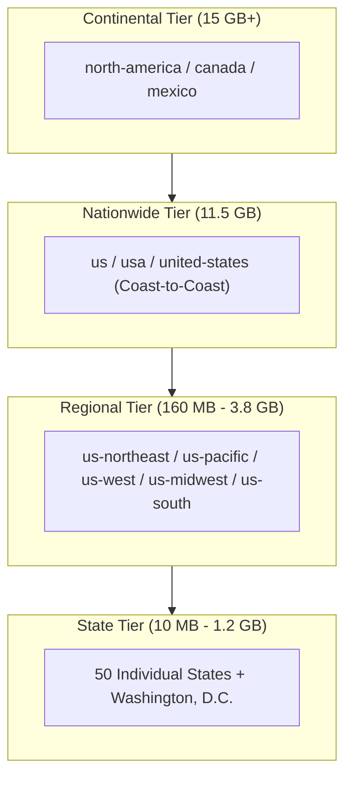

# Spatial Data & GraphHopper Routing Engine

PathPress uses OpenStreetMap (OSM) PBF extracts and an embedded GraphHopper routing engine to perform deterministic vehicle routing, elevation analysis, and spatial querying.

---

## Geographic Dataset Hierarchy

PathPress organizes geographic spatial data into four distinct tiers:



---

## PBF Resolution & Graph Cache Derivation

### Dataset Slug Extraction
The `PbfPathResolver` inspects input paths or target names and extracts a clean, normalized slug:

```kotlin
// Example slug resolutions:
"data/california-latest.osm.pbf" -> "california"
"data/us-northeast-latest.osm.pbf" -> "us-northeast"
"data/us-latest.osm.pbf"           -> "us"
"/custom/path/my_map.pbf"          -> "my-map"
```

### Storage Isolation (`.graphhopper/<slug>`)
GraphHopper graphs are cached on disk per dataset slug in `.graphhopper/<slug>/`. This ensures that routing graphs for different states, regions, or nationwide extracts never collide.

```
.graphhopper/
├── california/
│   ├── edges
│   ├── geometry
│   ├── location_index
│   ├── nodes
│   └── properties
├── us-northeast/
│   ├── edges
│   ├── ...
├── us/
│   ├── edges
│   ├── ...
└── ...
```

---

## GraphHopper Routing & Profiles

### Routing Profiles
PathPress configures custom vehicle routing profiles:
- **`scenic` (Default)**: Prioritizes scenic byways, national park highways, coastal roads, and secondary routes with scenic elevation deltas, while penalizing repetitive multi-lane interstates where scenic alternatives exist.
- **`car`**: Standard fastest-path vehicle routing prioritizing highway networks.

### Graph Lifecycle
1. **Initial Build**: On the first execution against a new PBF, GraphHopper reads nodes, ways, and relations, constructs edge geometries, builds the spatial location index, and compiles Contraction Hierarchies (CH) shortcuts.
2. **Persistence**: The graph is saved to disk under `.graphhopper/<slug>`.
3. **Subsequent Runs**: When the cached directory exists, GraphHopper loads directly from disk in seconds without reprocessing the raw PBF.

---

## Memory Footprint & Scaling Guidelines

| Tier | PBF Size | Initial Graph Build Time | Memory Footprint (RAM) | Typical Query Time |
|---|---|---|---|---|
| **Small State** (e.g. `rhode-island`, `hawaii`) | 10 MB – 100 MB | 5 – 15 seconds | 1 GB – 2 GB | < 1 second |
| **Large State** (e.g. `california`, `texas`) | 500 MB – 1.2 GB | 45 – 90 seconds | 2 GB – 4 GB | 1 – 3 seconds |
| **Regional Extract** (e.g. `us-northeast`, `us-west`) | 1.8 GB – 3.8 GB | 2 – 5 minutes | 4 GB – 8 GB | 2 – 8 seconds |
| **Nationwide Extract** (`us-latest`) | 11.5 GB | 15 – 25 minutes | 16 GB – 32 GB | 5 – 15 seconds |

> [!TIP]
> When building the nationwide USA graph for the first time, allocate at least `-Xmx24g` to the JVM process to accommodate GraphHopper's node-edge memory buffers.

---

## Spatial Indexing & Corridor Buffering

### Route Polyline Decomposition
Once a route is computed, GraphHopper returns a 3D geometry coordinate polyline (longitude, latitude, elevation). PathPress extracts polyline segments and creates an envelope buffer.

### Corridor Bounding Box & KD-Tree
- **Spatial Envelope**: A 2D bounding polygon expanded by a parameterized corridor radius (typically 5 to 25 km depending on route duration).
- **Proximity Filtering**: Nodes within the envelope are indexed into a spatial KD-tree to quickly evaluate perpendicular distance from the main driving path.
- **Elevation Profiling**: Elevation vertices are sampled along the polyline to compute total ascent, descent, and gradient charts.

### Geometric Calculations & Projections
PathPress relies on `GeoUtils` for core spatial calculations across routing and POI extraction:
- **Haversine Distance**: Great-circle spherical distance between any two coordinates ($R = 6,371\text{ km}$).
- **Segment Projection**: Orthogonal projection parameter $t \in [0, 1]$ onto line segments with latitude-cosine scaling.
- **Corridor Distance**: Minimum distance from any candidate POI or town to the route polyline.
