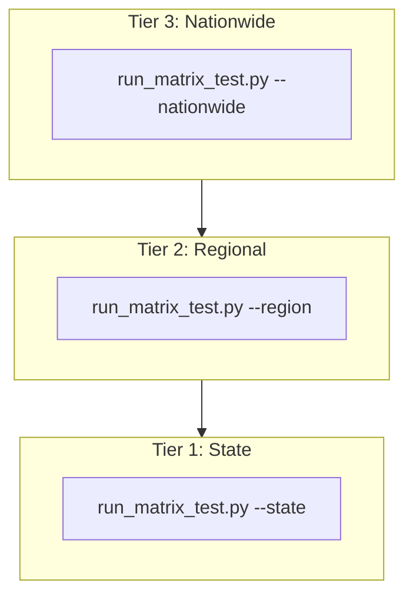

# Automated Matrix Testing & Verification

PathPress includes an automated E2E matrix runner that validates routing graphs, spatial geocoding, daily leg segmentation, and PDF generation across US States, regional corridors, and nationwide coast-to-coast routes.

---

## The 3-Tier Testing Architecture



---

## Test Runner Usage & Commands

### State Matrix Testing (Tier 1)
```bash
# Test a single state matrix
python3 scripts/run_matrix_test.py --state california
python3 scripts/run_matrix_test.py --state texas
python3 scripts/run_matrix_test.py --state rhode-island

# Test all 50 states + DC sequentially
python3 scripts/run_matrix_test.py --state all
```

### Regional Matrix Testing (Tier 2)
```bash
# Test multi-state corridors within a specific region
python3 scripts/run_matrix_test.py --region us-northeast
python3 scripts/run_matrix_test.py --region us-west
python3 scripts/run_matrix_test.py --region us-pacific

# Test all 5 regional matrices sequentially
python3 scripts/run_matrix_test.py --region all

# Batch-execute individual state matrices within a region
python3 scripts/run_matrix_test.py --region us-pacific --batch-states
```

### Nationwide Matrix Testing (Tier 3)
```bash
# Run coast-to-coast transcontinental tests against data/us-latest.osm.pbf
python3 scripts/run_matrix_test.py --nationwide
```

---

## Geofabrik Boundary Taxonomy

To prevent `PointNotFoundException` or graph clipping, each test corridor is strictly mapped within its valid Geofabrik geographic extract:

| Regional Extract | File Size | Constituent States / Territories | Sample Test Corridors |
|---|---|---|---|
| **`us-northeast`** | 1.78 GB | CT, ME, MA, NH, NJ, NY, PA, RI, VT | Boston ➔ Philadelphia, NYC ➔ Pittsburgh, Portland ➔ Providence |
| **`us-pacific`** | 162.8 MB | AK, HI, Pacific Territories | Anchorage ➔ Fairbanks, Denali ➔ Valdez, Honolulu ➔ Kailua |
| **`us-west`** | 3.15 GB | AZ, CA, CO, ID, MT, NV, NM, OR, UT, WA, WY | Seattle ➔ San Francisco, Portland ➔ Los Angeles, SF ➔ Las Vegas |
| **`us-midwest`** | 2.31 GB | IL, IN, IA, KS, MI, MN, MO, NE, ND, OH, SD, WI | Chicago ➔ Minneapolis, Detroit ➔ St. Louis, Omaha ➔ Columbus |
| **`us-south`** | 3.82 GB | AL, AR, DE, DC, FL, GA, KY, LA, MD, MS, NC, OK, SC, TN, TX, VA, WV | Atlanta ➔ New Orleans, Nashville ➔ Austin, Miami ➔ Charlotte |
| **`us` (Nationwide)** | 11.5 GB | All Contiguous Lower 48 States | Seattle ➔ Miami (10d), New York ➔ Los Angeles (8d) |

---

## Test Case Diversity & Permutations

Each test matrix systematically evaluates multiple route profiles to ensure robust edge-case coverage:
1. **Major Metropolitan**: High graph-density routes connecting primary urban centers.
2. **Scenic & Mountain Passes**: High elevation delta routes through national parks, mountain passes, and coastal byways.
3. **Rural & Remote**: Long-distance traversals with sparse graph nodes and wide distance between towns.
4. **Island & Non-Contiguous**: Island road networks (Hawaii) and sub-arctic routes (Alaska).
5. **Raw Coordinate Pairs**: Direct `lat,lng` strings (`37.7749,-122.4194 ➔ 34.0537,-118.2427`) testing reverse geocoding and nearest-node graph snapping.
6. **Unit Systems**: Mixed `imperial` (miles) and `metric` (kilometers) test cases.

---

## Output Artifacts & Reporting

Generated PDF itineraries and test logs are written to `build/matrix-output/`:

```
build/matrix-output/
├── california/
│   ├── california_case_1.pdf
│   ├── california_case_2.pdf
│   └── ...
├── us-northeast/
│   ├── us-northeast_case_1.pdf
│   └── ...
└── nationwide/
    ├── us_case_1.pdf  # Seattle, WA ➔ Miami, FL (10-day cross country)
    └── us_case_2.pdf  # New York, NY ➔ Los Angeles, CA (8-day Route 66)
```

---

## Gradle Unit & Integration Testing

In accordance with `AGENTS.md` Rule 6, all code modifications must be formatted and verified with the Kotlin test suite:

```bash
./gradlew ktfmtFormat test
```

Current test suite baseline: **201 / 201 unit and integration tests passing** (0 failures, 0 skipped).
